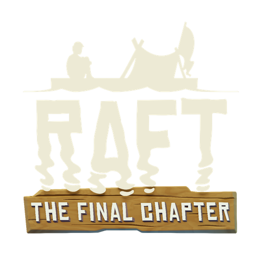

[][Raft]
  
 
 

<!-- > Table -->
| Mod | Repository | RaftModding | License
|:---:|:------:|:-----------:|:-------:
| `Mod Updater` | [![Button GitHub]][GitHub Mod Updater] | [![Button RaftModding]][RaftModding Mod Updater] | <kbd>  AGPLv3  </kbd>
| `Health Setter` | [![Button GitHub]][GitHub Health Setter] | [![Button RaftModding]][RaftModding Health Setter] | <kbd>  AGPLv3  </kbd>
| `Bulk Crafting` | [![Button GitHub]][GitHub Bulk Crafting] | [![Button RaftModding]][RaftModding Bulk Crafting] | <kbd>  AGPLv3  </kbd>
| `Custom Moving Speed` | [![Button GitHub]][GitHub Custom Moving Speed] | [![Button RaftModding]][RaftModding Custom Moving Speed] | <kbd>  AGPLv3  </kbd>
| `Swim Sprint` | [![Button GitHub]][GitHub Swim Sprint] | [![Button RaftModding]][RaftModding Swim Sprint] | <kbd>  ???  </kbd>
| `Augmented Equipment` | [![Button GitLab]][GitLab Augmented Equipment] | [![Button RaftModding]][RaftModding Augmented Equipment] | <kbd>  ???  </kbd>
| `Quick Stack Inventory` | [![Button GitHub]][GitHub Quick Stack Inventory] | [![Button RaftModding]][RaftModding Quick Stack Inventory] | <kbd>  AGPLv3  </kbd>
| `Alternate Recipes` | [![Button GitHub]][GitHub Alternate Recipes] | [![Button RaftModding]][RaftModding Alternate Recipes] | <kbd>  AGPLv3  </kbd>
| `Lantern Physics` | [![Button GitHub]][GitHub Lantern Physics] | [![Button RaftModding]][RaftModding Lantern Physics] | <kbd>  AGPLv3  </kbd>
| `Comfortable Inventory` | [![Button GitHub]][GitHub Comfortable Inventory] | [![Button RaftModding]][RaftModding Comfortable Inventory] | <kbd>  AGPLv3  </kbd>
| `GameMode` | [![Button GitLab]][GitLab GameMode] | [![Button RaftModding]][RaftModding GameMode] | <kbd>  ???  </kbd>
| `Raftipelago` | [![Button GitHub]][GitHub Raftipelago] | [![Button RaftModding]][RaftModding Raftipelago] | <kbd>  AGPLv3  </kbd>
| `Harder Easy-Deaths` | [![Button GitHub]][GitHub Harder Easy-Deaths] | [![Button RaftModding]][RaftModding Harder Easy-Deaths] | <kbd>  MIT  </kbd>
| `Raft is not shark food` | [![Button GitLab]][GitLab Raft is not shark food] | [![Button RaftModding]][RaftModding Raft is not shark food] | <kbd>  ???  </kbd>
| `Craft Cassettes` | [![Button GitHub]][GitHub Craft Cassettes] | [![Button RaftModding]][RaftModding Craft Cassettes] | <kbd>  AGPLv3  </kbd>
| `Inventory Tweaks` | [![Button GitHub]][GitHub Inventory Tweaks] | [![Button RaftModding]][RaftModding Inventory Tweaks] | <kbd>  AGPLv3  </kbd>
| `Inventory Stack` | [![Button GitHub]][GitHub Inventory Stack] | [![Button RaftModding]][RaftModding Inventory Stack] | <kbd>  MIT  </kbd>
| `Tikis are not made of metal!` | [![Button GitHub]][GitHub Tikis are not made of metal!] | [![Button RaftModding]][RaftModding Tikis are not made of metal!] | <kbd>  AGPLv3  </kbd>
| `Realistic Mod` | [![Button GitHub]][GitHub Realistic Mod] | [![Button RaftModding]][RaftModding Realistic Mod] | <kbd>  AGPLv3  </kbd>
| `Where Is My Dishes` | [![Button GitHub]][GitHub Where Is My Dishes] | [![Button RaftModding]][RaftModding Where Is My Dishes] | <kbd>  AGPLv3  </kbd>
| `SpeedyGonzales` | [![Button GitHub]][GitHub SpeedyGonzales] | [![Button RaftModding]][RaftModding SpeedyGonzales] | <kbd>  AGPLv3  </kbd>
| `No Durability Plus` | [![Button GitHub]][GitHub No Durability Plus] | [![Button RaftModding]][RaftModding No Durability Plus] | <kbd>  GPLv3  </kbd>
| `Minimap` | [![Button GitHub]][GitHub Minimap] | [![Button RaftModding]][RaftModding Minimap] | <kbd>  AGPLv3  </kbd>
| `Craft Developer Items` | [![Button GitHub]][GitHub Craft Developer Items] | [![Button RaftModding]][RaftModding Craft Developer Items] | <kbd>  AGPLv3  </kbd>
| `Filtered Nets` | [![Button GitHub]][GitHub Filtered Nets] | [![Button RaftModding]][RaftModding Filtered Nets] | <kbd>  MIT  </kbd>
| `Craftable Explosive Goo` | [![Button GitHub]][GitHub Craftable Explosive Goo] | [![Button RaftModding]][RaftModding Craftable Explosive Goo] | <kbd>  AGPLv3  </kbd>
| `Auto Recipe Redux` | [![Button GitHub]][GitHub Auto Recipe Redux] | [![Button RaftModding]][RaftModding Auto Recipe Redux] | <kbd>  MIT  </kbd>
| `Water Wheels` | [![Button GitHub]][GitHub Water Wheels] | [![Button RaftModding]][RaftModding Water Wheels] | <kbd>  ???  </kbd>
| `Raft MMO` | [![Button GitHub]][GitHub Raft MMO] | [![Button RaftModding]][RaftModding Raft MMO] | <kbd>  MIT  </kbd>
| `Custom Tool Speed` | [![Button GitLab]][GitLab Custom Tool Speed] | [![Button RaftModding]][RaftModding Custom Tool Speed] | <kbd>  ???  </kbd>
| `Inventory Before Hotbar` | [![Button GitHub]][GitHub Inventory Before Hotbar] | [![Button RaftModding]][RaftModding Inventory Before Hotbar] | <kbd>  AGPLv3  </kbd>
| `Foundation Count` | [![Button GitHub]][GitHub Foundation Count] | [![Button RaftModding]][RaftModding Foundation Count] | <kbd>  AGPLv3  </kbd>
| `Fish Seated` | [![Button GitHub]][GitHub Fish Seated] | [![Button RaftModding]][RaftModding Fish Seated] | <kbd>  AGPLv3  </kbd>
| `Old World Radio` | [![Button GitHub]][GitHub Old World Radio] | [![Button RaftModding]][RaftModding Old World Radio] | <kbd>  MIT  </kbd>
| `Name Your Shark` | [![Button GitHub]][GitHub Name Your Shark] | [![Button RaftModding]][RaftModding Name Your Shark] | <kbd>  MIT  </kbd>
| `Almost No Durability` | [![Button GitHub]][GitHub Almost No Durability] | [![Button RaftModding]][RaftModding Almost No Durability] | <kbd>  AGPLv3  </kbd>
| `Raft Cost` | [![Button GitHub]][GitHub Raft Cost] | [![Button RaftModding]][RaftModding Raft Cost] | <kbd>  AGPLv3  </kbd>
| `Sort Inventory` | [![Button GitHub]][GitHub Sort Inventory] | [![Button RaftModding]][RaftModding Sort Inventory] | <kbd>  MIT  </kbd>
| `Lantern Shadows` | [![Button GitHub]][GitHub Lantern Shadows] | [![Button RaftModding]][RaftModding Lantern Shadows] | <kbd>  MIT  </kbd>
| `MultiBind` | [![Button GitHub]][GitHub MultiBind] | [![Button RaftModding]][RaftModding MultiBind] | <kbd>  ???  </kbd>
| `Preset Commands` | [![Button GitHub]][GitHub Preset Commands] | [![Button RaftModding]][RaftModding Preset Commands] | <kbd>  ???  </kbd>
| `Augmented Items` | [![Button GitLab]][GitLab Augmented Items] | [![Button RaftModding]][RaftModding Augmented Items] | <kbd>  AGPLv3  </kbd>
| `Trees Drops Seeds: Reanimated` | [![Button GitHub]][GitHub Trees Drops Seeds: Reanimated] | [![Button RaftModding]][RaftModding Trees Drops Seeds: Reanimated] | <kbd>  AGPLv3  </kbd>
| `Antenna Anywhere` | [![Button GitHub]][GitHub Antenna Anywhere] | [![Button RaftModding]][RaftModding Antenna Anywhere] | <kbd>  MIT  </kbd>
| `Ctrl Shift Move` | [![Button GitLab]][GitLab Ctrl Shift Move] | [![Button RaftModding]][RaftModding Ctrl Shift Move] | <kbd>  AGPLv3  </kbd>
| `Ignore Build Collision` | [![Button GitHub]][GitHub Ignore Build Collision] | [![Button RaftModding]][RaftModding Ignore Build Collision] | <kbd>  AGPLv3  </kbd>
| `Craft From Storage` | [![Button GitHub]][GitHub Craft From Storage] | [![Button RaftModding]][RaftModding Craft From Storage] | <kbd>  MIT  </kbd>
| `BetterBowl` | [![Button GitLab]][GitLab BetterBowl] | [![Button RaftModding]][RaftModding BetterBowl] | <kbd>  AGPLv3  </kbd>
| `Only Night` | [![Button GitLab]][GitLab Only Night] | [![Button RaftModding]][RaftModding Only Night] | <kbd>  ???  </kbd>
| `Custom Weapon Damage` | [![Button GitLab]][GitLab Custom Weapon Damage] | [![Button RaftModding]][RaftModding Custom Weapon Damage] | <kbd>  ???  </kbd>
| `Custom Growth Speed` | [![Button GitLab]][GitLab Custom Growth Speed] | [![Button RaftModding]][RaftModding Custom Growth Speed] | <kbd>  ???  </kbd>
| `Utility Craft +` | [![Button GitHub]][GitHub Utility Craft +] | [![Button RaftModding]][RaftModding Utility Craft +] | <kbd>  ???  </kbd>
| `Pause Mod` | [![Button GitHub]][GitHub Pause Mod] | [![Button RaftModding]][RaftModding Pause Mod] | <kbd>  GPLv3  </kbd>
| `Longer Day Night Cycles` | [![Button GitHub]][GitHub Longer Day Night Cycles] | [![Button RaftModding]][RaftModding Longer Day Night Cycles] | <kbd>  MIT  </kbd>
| `Mumble Link` | [![Button GitHub]][GitHub Mumble Link] | [![Button RaftModding]][RaftModding Mumble Link] | <kbd>  ???  </kbd>
| `More Shark Bait` | [![Button GitHub]][GitHub More Shark Bait] | [![Button RaftModding]][RaftModding More Shark Bait] | <kbd>  ???  </kbd>
| `More Rare Animals` | [![Button GitHub]][GitHub More Rare Animals] | [![Button RaftModding]][RaftModding More Rare Animals] | <kbd>  MIT  </kbd>
| `Better Jars` | [![Button GitHub]][GitHub Better Jars] | [![Button RaftModding]][RaftModding Better Jars] | <kbd>  ???  </kbd>
| `Custom Maximum Raft Speed` | [![Button GitHub]][GitHub Custom Maximum Raft Speed] | [![Button RaftModding]][RaftModding Custom Maximum Raft Speed] | <kbd>  MIT  </kbd>
| `Inventory Persist` | [![Button GitHub]][GitHub Inventory Persist] | [![Button RaftModding]][RaftModding Inventory Persist] | <kbd>  GPLv3  </kbd>
| `Find Raft Center` | [![Button GitHub]][GitHub Find Raft Center] | [![Button RaftModding]][RaftModding Find Raft Center] | <kbd>  ???  </kbd>
| `Better Crop Plots` | [![Button GitHub]][GitHub Better Crop Plots] | [![Button RaftModding]][RaftModding Better Crop Plots] | <kbd>  ???  </kbd>
| `Recycle Your Metal` | [![Button GitHub]][GitHub Recycle Your Metal] | [![Button RaftModding]][RaftModding Recycle Your Metal] | <kbd>  ???  </kbd>
| `DevTools` | [![Button GitLab]][GitLab DevTools] | [![Button RaftModding]][RaftModding DevTools] | <kbd>  ???  </kbd>

  

 

<!----------------------------------------------------------------------------->

[Raft]: https://raft-game.com/

<!---------------------------------[ Buttons ]--------------------------------->

[Button RaftModding]: https://img.shields.io/badge/RaftModding-3498db?style=for-the-badge&logoColor=white&logo=Wireshark
[Button GitHub]: https://img.shields.io/badge/GitHub-222222?style=for-the-badge&logoColor=white&logo=GitHub
[Button GitLab]: https://img.shields.io/badge/GitLab-FC6D26?style=for-the-badge&logoColor=white&logo=GitLab

<!----------------------------------[ Links ]---------------------------------->

<!-- > GitHub -->
[GitHub Mod Updater]: https://GitHub.com/FranzFischer78/ModUpdater
[GitHub Health Setter]: https://GitHub.com/derfuxde/healthsetter
[GitHub Bulk Crafting]: https://GitHub.com/thmsndk/Raft-BulkCrafting
[GitHub Custom Moving Speed]: https://GitHub.com/KenjieDec/CustomMovingSpeed
[GitHub Swim Sprint]: https://GitHub.com/KenjieDec/SwimSprint
[GitHub Quick Stack Inventory]: https://GitHub.com/MahmoudOkasha17/QuickStackInventory
[GitHub Alternate Recipes]: https://GitHub.com/Phantom139/RaftAlternateRecipes
[GitHub Lantern Physics]: https://GitHub.com/FZ-Applications/raft-lantern-physics-mod
[GitHub Comfortable Inventory]: https://GitHub.com/kohanis/raft-comfortable-inventory
[GitHub Raftipelago]: https://GitHub.com/SunnyBat/Raftipelago
[GitHub Harder Easy-Deaths]: https://GitHub.com/GoryMoon/HarderEasyDeath
[GitHub Craft Cassettes]: https://GitHub.com/libkuza/raftmod_craftCassettes
[GitHub Inventory Tweaks]: https://GitHub.com/thmsndk/Raft-InventoryTweaks
[GitHub Inventory Stack]: https://GitHub.com/dakotahawkins/Raft-Inventory-Stack
[GitHub Tikis are not made of metal!]: https://GitHub.com/fourst4r/TikisAreNotMadeOfMetal
[GitHub Realistic Mod]: https://GitHub.com/Lcraft-Developers/RealisticMod
[GitHub Where Is My Dishes]: https://GitHub.com/DeadByte42/Raft-WhereIsMyDishes
[GitHub SpeedyGonzales]: https://GitHub.com/NajiShehab/SpeedyGonzales
[GitHub No Durability Plus]: https://GitHub.com/ArmyOfOptimists/NoDurabilityPlus
[GitHub Minimap]: https://GitHub.com/Whitebrim/Minimap
[GitHub Craft Developer Items]: https://GitHub.com/Looooooke/CraftDeveloperItems
[GitHub Filtered Nets]: https://GitHub.com/janniksam/RaftMod.FilteredNets
[GitHub Craftable Explosive Goo]: https://GitHub.com/Looooooke/CraftableExplosiveGoo
[GitHub Auto Recipe Redux]: https://GitHub.com/burnedram/raftmod-autorecipe
[GitHub Water Wheels]: https://GitHub.com/made-by-traxam/raft-waterwheel-mod
[GitHub Raft MMO]: https://GitHub.com/maxvollmer/RaftMMO
[GitHub Inventory Before Hotbar]: https://GitHub.com/dcsobral/raft-inventory-before-hotbar
[GitHub Foundation Count]: https://GitHub.com/dcsobral/FoundationCount
[GitHub Fish Seated]: https://GitHub.com/dcsobral/fishSeated
[GitHub Old World Radio]: https://GitHub.com/1bitgodot/Raft_OldWorldRadio
[GitHub Name Your Shark]: https://GitHub.com/Dinnerbone/name-your-shark
[GitHub Almost No Durability]: https://GitHub.com/Felix-Staud/raft-mods/tree/main/almost-no-durability
[GitHub Raft Cost]: https://GitHub.com/romaindurand/raft-cost
[GitHub Sort Inventory]: https://GitHub.com/made-by-traxam/RaftModSortInventory
[GitHub Lantern Shadows]: https://GitHub.com/peettee/Lantern-Shadows
[GitHub MultiBind]: https://GitHub.com/Aidanamite/MultiBind
[GitHub Preset Commands]: https://GitHub.com/Aidanamite/presetCommands
[GitHub Trees Drops Seeds: Reanimated]: https://GitHub.com/Azzmurr/raft-mods/tree/master/trees-drops-seeds-reanimated
[GitHub Antenna Anywhere]: https://GitHub.com/KevoSoftworks/AntennaAnywhere
[GitHub Ignore Build Collision]: https://GitHub.com/soggylithe/IgnoreBuildCollision
[GitHub Craft From Storage]: https://GitHub.com/Azzmurr/raft-mods/tree/master/craft-from-storage
[GitHub Utility Craft +]: https://GitHub.com/SWiRaki/UtilCraftPlus
[GitHub Pause Mod]: https://GitHub.com/Echo343/PauseMod
[GitHub Longer Day Night Cycles]: https://GitHub.com/janniksam/RaftMod.LongerDayNightCycles
[GitHub Mumble Link]: https://GitHub.com/jeffpeterson/RaftMumbleLink
[GitHub More Shark Bait]: https://GitHub.com/camarril/MoreSharkBait
[GitHub More Rare Animals]: https://GitHub.com/janniksam/RaftMod.MoreRareAnimals
[GitHub Better Jars]: https://GitHub.com/0xN0x/raft-betterjars-mod
[GitHub Custom Maximum Raft Speed]: https://GitHub.com/janniksam/RaftMod.CustomMaxRaftSpeed
[GitHub Inventory Persist]: https://GitHub.com/scwheele/invpersist
[GitHub Find Raft Center]: https://GitHub.com/camarril/FindRaftCenter
[GitHub Better Crop Plots]: https://GitHub.com/0xN0x/raft-bettercropplot-mod
[GitHub Recycle Your Metal]: https://GitHub.com/0xN0x/raft-recycleyourmetal-mod

<!-- > GitLab -->
[GitLab Augmented Equipment]: https://GitLab.com/yunjang/augmented-equipment
[GitLab GameMode]: https://GitLab.com/traxam/raft-gamemode-mod
[GitLab Raft is not shark food]: https://GitLab.com/3stadt/raftisnotsharkfood
[GitLab Custom Tool Speed]: https://GitLab.com/traxam/raft-customtoolspeed-mod
[GitLab Augmented Items]: https://GitLab.com/yunjang/augmented-items
[GitLab Ctrl Shift Move]: https://GitLab.com/yunjang/ctrl-shift-move
[GitLab BetterBowl]: https://GitLab.com/traxam/raft-betterbowl-mod
[GitLab Only Night]: https://GitLab.com/traxam/raft-onlynight-mod
[GitLab Custom Weapon Damage]: https://GitLab.com/traxam/raft-customweapondamage-mod
[GitLab Custom Growth Speed]: https://GitLab.com/traxam/raft-customgrowthspeed-mod
[GitLab DevTools]: https://GitLab.com/traxam/raft-devtoolsmod

<!-- > RaftModding -->
[RaftModding Mod Updater]: https://www.raftmodding.com/mods/modupdater
[RaftModding Health Setter]: https://www.raftmodding.com/mods/health-setter
[RaftModding Bulk Crafting]: https://www.raftmodding.com/mods/bulk-crafting
[RaftModding Custom Moving Speed]: https://www.raftmodding.com/mods/custommovingspeed
[RaftModding Swim Sprint]: https://www.raftmodding.com/mods/swimsprint
[RaftModding Augmented Equipment]: https://www.raftmodding.com/mods/augmented-equipment
[RaftModding Quick Stack Inventory]: https://www.raftmodding.com/mods/quick-stack-inventory
[RaftModding Alternate Recipes]: https://www.raftmodding.com/mods/alternate-recipes
[RaftModding Lantern Physics]: https://www.raftmodding.com/mods/lantern-physics
[RaftModding Comfortable Inventory]: https://www.raftmodding.com/mods/comfortable-inventory
[RaftModding GameMode]: https://www.raftmodding.com/mods/gamemode
[RaftModding Raftipelago]: https://www.raftmodding.com/mods/raftipelago
[RaftModding Harder Easy-Deaths]: https://www.raftmodding.com/mods/harder-easy-death
[RaftModding Raft is not shark food]: https://www.raftmodding.com/mods/raft-is-not-shark-food
[RaftModding Craft Cassettes]: https://www.raftmodding.com/mods/craft-cassettes
[RaftModding Inventory Tweaks]: https://www.raftmodding.com/mods/inventory-tweaks
[RaftModding Inventory Stack]: https://www.raftmodding.com/mods/inventory-stack
[RaftModding Tikis are not made of metal!]: https://www.raftmodding.com/mods/tikis-are-not-made-of-metal
[RaftModding Realistic Mod]: https://www.raftmodding.com/mods/realistic-mod
[RaftModding Where Is My Dishes]: https://www.raftmodding.com/mods/where-is-my-dishes
[RaftModding SpeedyGonzales]: https://www.raftmodding.com/mods/speedygonzales
[RaftModding No Durability Plus]: https://www.raftmodding.com/mods/no-durability-plus
[RaftModding Minimap]: https://www.raftmodding.com/mods/minimap
[RaftModding Craft Developer Items]: https://www.raftmodding.com/mods/craft-dev-items
[RaftModding Filtered Nets]: https://www.raftmodding.com/mods/filterednets
[RaftModding Craftable Explosive Goo]: https://www.raftmodding.com/mods/craftableexplosivegoo
[RaftModding Auto Recipe Redux]: https://www.raftmodding.com/mods/auto-recipe-redux
[RaftModding Water Wheels]: https://www.raftmodding.com/mods/waterwheel
[RaftModding Raft MMO]: https://www.raftmodding.com/mods/raftmmo
[RaftModding Custom Tool Speed]: https://www.raftmodding.com/mods/customtoolspeed
[RaftModding Inventory Before Hotbar]: https://www.raftmodding.com/mods/inventory-before-hotbar
[RaftModding Foundation Count]: https://www.raftmodding.com/mods/foundationcount
[RaftModding Fish Seated]: https://www.raftmodding.com/mods/fish-seated
[RaftModding Old World Radio]: https://www.raftmodding.com/mods/old-world-radio
[RaftModding Name Your Shark]: https://www.raftmodding.com/mods/name-your-shark
[RaftModding Almost No Durability]: https://www.raftmodding.com/mods/almost-no-durability
[RaftModding Raft Cost]: https://www.raftmodding.com/mods/raft-cost
[RaftModding Sort Inventory]: https://www.raftmodding.com/mods/sortinventory
[RaftModding Lantern Shadows]: https://www.raftmodding.com/mods/lantern-shadows
[RaftModding MultiBind]: https://www.raftmodding.com/mods/multi-bind
[RaftModding Preset Commands]: https://www.raftmodding.com/mods/preset-commands
[RaftModding Augmented Items]: https://www.raftmodding.com/mods/augmented-items
[RaftModding Trees Drops Seeds: Reanimated]: https://www.raftmodding.com/mods/trees-drops-seeds-reanimated
[RaftModding Antenna Anywhere]: https://www.raftmodding.com/mods/antenna-anywhere
[RaftModding Ctrl Shift Move]: https://www.raftmodding.com/mods/ctrl-shift-move
[RaftModding Ignore Build Collision]: https://www.raftmodding.com/mods/ignore-build-collision
[RaftModding Craft From Storage]: https://www.raftmodding.com/mods/craft-from-storage
[RaftModding BetterBowl]: https://www.raftmodding.com/mods/betterbowl
[RaftModding Only Night]: https://www.raftmodding.com/mods/onlynight
[RaftModding Custom Weapon Damage]: https://www.raftmodding.com/mods/customweapondamage
[RaftModding Custom Growth Speed]: https://www.raftmodding.com/mods/customgrowthspeed
[RaftModding Utility Craft +]: https://www.raftmodding.com/mods/utility-craft-plus
[RaftModding Pause Mod]: https://www.raftmodding.com/mods/pausemod
[RaftModding Longer Day Night Cycles]: https://www.raftmodding.com/mods/longerdaynightcycles
[RaftModding Mumble Link]: https://www.raftmodding.com/mods/mumble-link
[RaftModding More Shark Bait]: https://www.raftmodding.com/mods/moresharkbait
[RaftModding More Rare Animals]: https://www.raftmodding.com/mods/morerareanimals
[RaftModding Better Jars]: https://www.raftmodding.com/mods/better-jars
[RaftModding Custom Maximum Raft Speed]: https://www.raftmodding.com/mods/custommaxraftspeed
[RaftModding Inventory Persist]: https://www.raftmodding.com/mods/invpersist
[RaftModding Find Raft Center]: https://www.raftmodding.com/mods/findraftcenter
[RaftModding Better Crop Plots]: https://www.raftmodding.com/mods/better-cropplots
[RaftModding Recycle Your Metal]: https://www.raftmodding.com/mods/recycle-your-metal
[RaftModding DevTools]: https://www.raftmodding.com/mods/devtools

